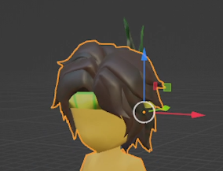

# Textura bugada: Mudança ao juntar malhas

#### Textura totalmente alterada ao juntar malhas dentro do blender? veja como resolver

Já aconteceu com você de estar juntando duas malhas do mesmo personagem (ou objeto) e, nessa brincadeira, as texturas mudam e ficam totalmente diferentes? Geralmente sendo "uma em função da outra". Em outras palavras, a textura de uma parte fica distorcida, sendo uma diferença que vai dependendo da ordem e de quem está juntando.

Abaixo mostrarei uns exemplos que ocorreram comido deste problema. Perceba que a mudança da textura varia quando junto o cabelo da pena e quando mudo do corpo para o cabelo.&#x20;

### Imagens do problema:

#### Antes:

#### Depois

* Na primeira imagem, juntei a camada do corpo do personagem com o pé, resultando em uma mudança total da textura do pé.
* Na segunda são, na verdade, dois exemplos que até já foram comentados anteriormente. Um em que juntei o cabelo com a pena, fazendo com que o cabelo e a faixa na testa mudassem de cor. No outro, juntei o cabelo com o corpo, o que fez mudar toda a textura do corpo.

### Resolvendo a problemática

Em resumo, este problema aconteceu basicamente porque estava utilizando as _**UV Map**s_ de nomes diferentes em cada objeto.

Enquanto um deles estava nomeada de _**"DiffuseUV",**_ a malha que eu queria juntar estava como _**"UVMap".**  No outro exemplo, um estava como **"UVMap"**_ e outro como _**"UVChannel\_1".**_&#x20;

Percebe-se que são todas as malhas com diferentes nomenclaturas que geraram esse problema, então ao renomeá-las com um mesmo nome em comum, o problema terá sido resolvido :thumbsup:

Para isso, basta ir em **Object Data Properties** e encontre **UV Maps:**

.png>)

#### Resultado:

