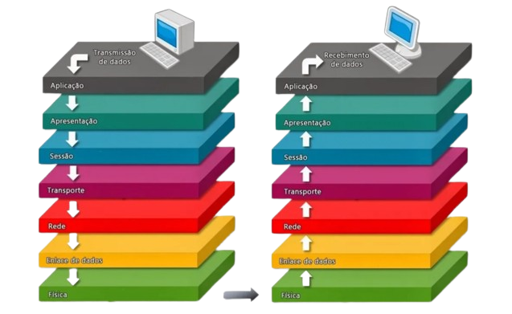

# 🥞 Redes: Modelo OSI à primeira vista

### Modelo de interconexão de sistemas abertos

###### Introdução

O modelo OSI (Open Systems Interconnection) é uma estrutura teórica que **define** uma arquitetura de rede de computadores em camadas. Criado pela International Organization for Standardization (ISO), o modelo OSI é usado para **padronizar** a comunicação de dados entre diferentes sistemas de computadores. 

Esse modelo é dividido em sete camadas, cada uma com funções específicas e independentes, desde a camada física até a camada de aplicação. Cada camada é responsável por tratar de uma parte específica da comunicação de dados, tornando a troca de informações mais eficiente.

O modelo OSI é importante porque fornece uma base conceitual para o projeto e implementação de redes de computadores. Ele ajuda a identificar as funções e responsabilidades de cada camada, permitindo que os desenvolvedores possam criar soluções mais eficientes e compatíveis com diferentes sistemas.

Por exemplo, a **camada física** lida com as características elétricas e físicas da comunicação de dados, enquanto a **camada de aplicação** lida com a interação do usuário com os aplicativos que utilizam a rede.

Apesar de ser amplamente utilizado em treinamentos e certificações na área de redes de computadores, é importante ressaltar que **nem sempre as redes seguem o modelo OSI estritamente na prática**. Muitas vezes, são usados modelos híbridos, com camadas diferentes ou combinações de protocolos, dependendo das necessidades específicas da rede.

Mesmo com as adaptações, o **modelo OSI continua sendo uma referência** importante para o desenvolvimento de redes de computadores. Compreender sua estrutura e suas camadas pode ajudar a entender o funcionamento de redes e sistemas de comunicação de dados.
